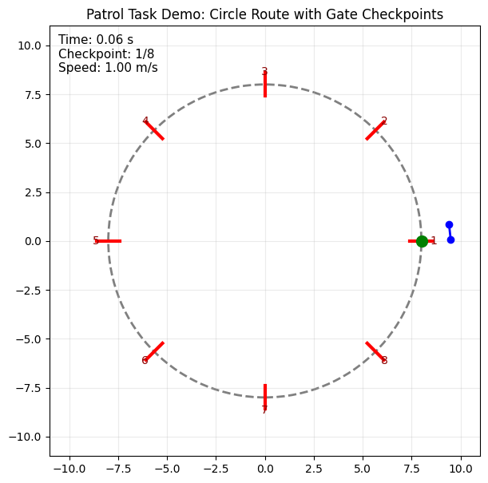

## Docs:
- Overleaf: [link](https://www.overleaf.com/project/69e14af9f0dffb3cf79c497b)
- Google docs: [link]()

## Tentative Project: Patrol system with checkpoints, minimize time
(Add any helpful information!) 
Demo: 

### Breakdown
- Physical model (2D for simplicity) with dynamics:
    - Four-wheel car
    - Or Drone (quatrator in HW1)
- Task: let robot patrol around a given route, and it must pass few checkpoints (imagine Formula 1)
- Objective: minimize time consumption
- Constraints: 
    - x/y/angular maximum speed
    - no collision (not deviate from the design path too much)
- Reference (not necessary)

### Dynamics

### Manipulator equation

Plannar quadrator:

$$
m\ddot q_1(t) = -\sin(q_3(t))\big(u_1(t)+u_2(t)\big), \\
m\ddot q_2(t) + mg = \cos(q_3(t))\big(u_1(t)+u_2(t)\big), \\
I\ddot q_3(t) = r\big(u_2(t)-u_1(t)\big), \\
$$

Car:

$$
\begin{cases}
m\ddot x = F\cos\theta \\
m\ddot y = F\sin\theta \\
I_z\ddot \theta = \tau_z
\end{cases}
$$

Or 

$$
\underbrace{
\begin{bmatrix}
m&0&0\\
0&m&0\\
0&0&I_z
\end{bmatrix}
}_{M(q)}
\ddot q
=\underbrace{
\begin{bmatrix}
F\cos\theta\\
F\sin\theta\\
\tau_z
\end{bmatrix}
}_{\tau}
$$

### Solution
