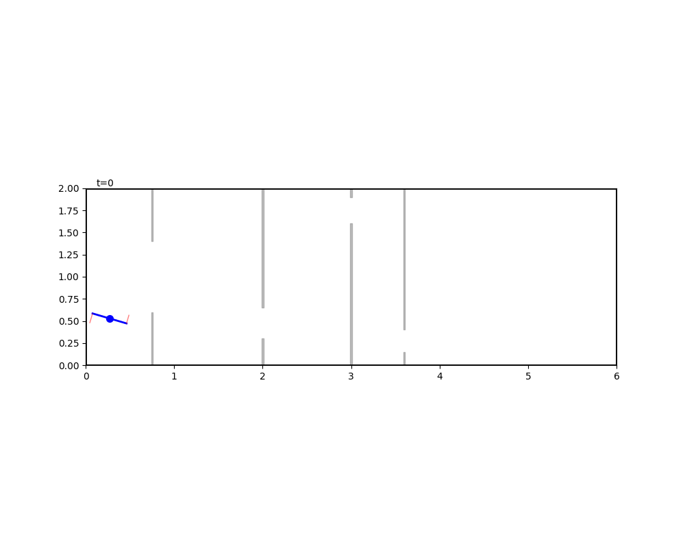

## Docs:
- Overleaf: [link](https://www.overleaf.com/project/6a11684f4de1f4e676ab6b45)
- Slide: [link](https://docs.google.com/presentation/d/19Y5HKb4kWksdJhwh4jv9UD1ZJLGkIPckAD13lv50kEk/edit?slide=id.g4702670f3a_2_74#slide=id.g4702670f3a_2_74)

## Planar quadrator control with checkpoints, minimize efforts
Demo (others are in the [results/](results/) folder):

    

### Breakdown
- Physical model (2D for simplicity) with dynamics:
    - Drone (quatrator in HW1)
- Task: let robot patrol around a given route, and it must pass few checkpoints (imagine Formula 1)
- Objective: minimize effort ($\sum_{k=0}^{NT}u_k^2$)
- Constraints: 
    - maximum angular and its speed
    - maximum thrust
    - no collision (not deviate from the design path too much)
- Reference (not necessary)

### Dynamics

### Manipulator equation

Plannar quadrator:

$$
\begin{align}
m\ddot q_1(t) = -\sin(q_3(t))\big(u_1(t)+u_2(t)\big) \\
m\ddot q_2(t) + mg = \cos(q_3(t))\big(u_1(t)+u_2(t)\big) \\
I\ddot q_3(t) = r\big(u_2(t)-u_1(t)\big) \\
\end{align}
$$

By $$\frac{(1)}{(2)}$$, $$q_3$$ can be acquired: $$q_3 = -tan^{-1}\frac{m\ddot{q_1}}{m\ddot{q_2}+mg}$$

### To Do:
- [x] dynamic function
- [x] environment visualization
- [x] trajectory optimization
    - [x] first-order approximation for equality constraints
    - [x] IPOPT solver
- [x] trajectory optimization in avoiding obstacles
    - [x] minimize efforts by decomposing obstacle validation constraints
    - [x] visulation of thrust polishment
    - [x] minimize time consumption by MICP

Rest Part are in [proposal](proposal/ECE594T_project_proposal.pdf)(outdated)
